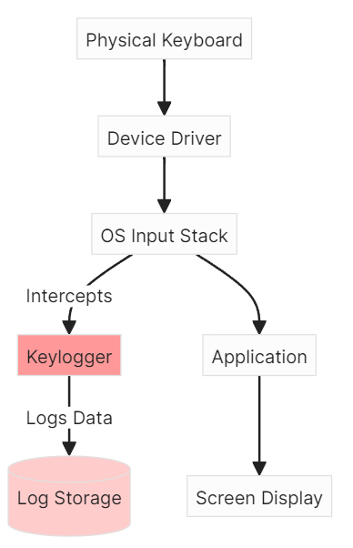

# Keylogger Report Super Awesome Project

<!-- - https://webcms3.cse.unsw.edu.au/COMP6441/24T3/resources/106807
- https://webcms3.cse.unsw.edu.au/COMP6441/24T3/resources/103079 -->

- A keylogger is a form of malware or hardware that keeps track of and records your keystrokes as you type. It takes the information and sends it to a hacker using a command-and-control (C&C) server.

- keyloggers operate the operating system level
- they capture the raw keyboard data input before sending it to the display server which is the screen.

- in my project, i developed in python. i chose python because it was simple to implement.
there are libraries that made it easy to listen and capture keybaord events. 
- unlike keyloggers developed in C, python keyloggers doesn't need to have deep system access or
control over system hooks, making it easy to implement
- this isnt ideal as python is easilyv detected by most firewalls and can be seen on task manager easily.

- keyloggers are normally delivered through social engineering attack vectors,
some form of email, or clicking a link installs the keylogger
- or drive by download, going to a malicious website can trigger a download of a keylogger
